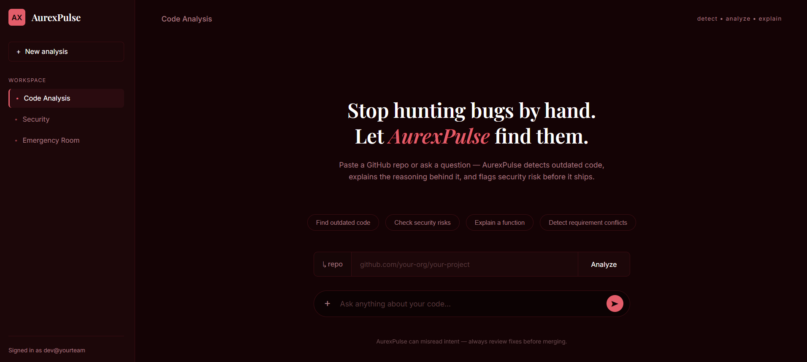
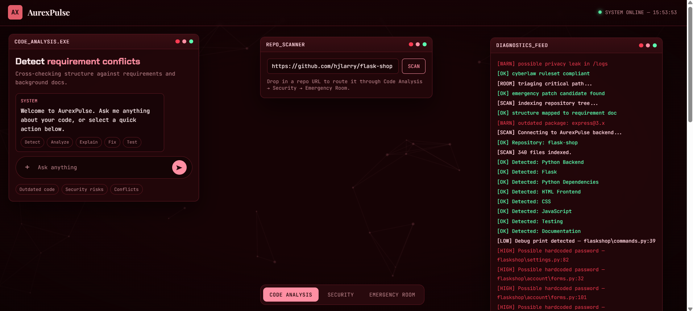
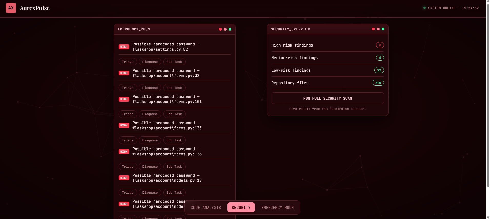
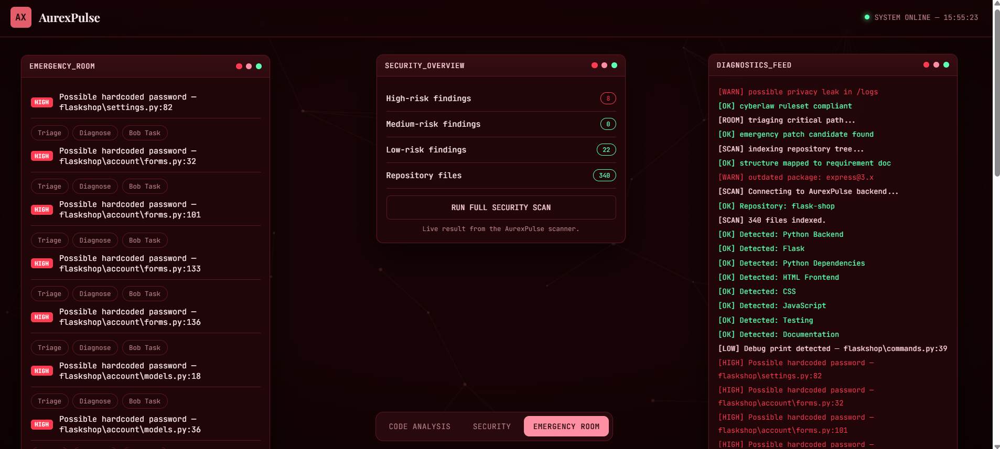

# IBM BOB 2.0 Hackathon-Team MiloKopiBeng-AurexPulse

AurexPulse
AI-powered code intelligence and security platform built with IBM Bob 2.0 to detect, diagnose, and resolve software issues before they become emergencies.
AurexPulse is a code intelligence and security platform built with IBM Bob 2.0. It analyzes public GitHub repositories, identifies potential code issues, and guides developers from issue discovery to recommended next steps.

## Problem
A development team can spend hours tracking down problem across the project. The application runs, but somewhere in the repository is a possible hardcoded password, an outdated dependency, security risks or code that no longer matches the project requirements. Finding and understanding these issues takes time as developers still must understand where the issues are, how serious it is, and what to do next. 

## Solutions

This is the homepage of AurexPulse. We built AurexPulse with IBM Bob to help developers investigate the problem. It is designed for small teams working on projects they may not know inside out. The process starts with the user enters a URL and asking a code question or checking security risks of the project. They can explore code in Code Analysis, view possible risks in Security, and focus on urgent findings in the Emergency Room.

On the left, developers can ask a question or choose an action such as detecting requirement conflicts. In the middle, they enter a GitHub repository URL to start a scan. On the right, the diagnostics feed shows what AurexPulse finds as it examines the project. It reads through every line of code, identifies backend and frontend files, flagged potential issues and points the developer to the code they need to inspect. The page helps the team move from an unfamiliar repository to a list of specific issues they can investigate and prioritize. 

The Security page scans the project to identify potential risks by severity and helps developers see which ones need attention first. It flags possible exposure of confidential information and displays the results of selected security-rule checks. Developers can then inspect each finding to determine whether there is a real security or compliance issue. 

Emergency Room brings the high-risk findings into one place so developers can investigate them first. Each finding shows where the suspected issue appears in the code and offers options to resolve it. This helps the team decide what needs action before release. In the planned workflow, specialized AI subagents will investigate the cause, propose a fix, and run a targeted test. The developer will review their findings and approve any code change. 

## What makes it unique? 

The idea behind AurexPulse is simple, an alert is useful only when developers know what to do with it. What makes it distinctive is the path from discovery to action, instead of leaving long lists of warnings, it connects each findings to the code and provides a clear step on how to resolve it. By connecting repository context, clear findings, and an investigation workflow, AurexPulse helps developers focus their limited time on the problems most likely to affect their release. Developers review the evidence and stay in control of any proposed code change. Our goal is to carry that process through to a targeted test, so the team can see whether an approved fix worked before shipping.

## IBM BOB Usage Statement
Part 1 – AI-Powered Code Analysis: Task Context

## Features
- Analyze a public GitHub repository
- Detect project types and inspect source files
- Review potential code issues and generate a risk report
- Route high-risk issues through the Emergency Room workflow
- Generate optimization tasks and IBM Bob prompts

## Run locally
Requirements
- Python
- Git

## Setup
git clone https://github.com/michellelim1507/IBM-BOB-2.0-Hackathon-TeamMiloKopiBeng-AurexPulse.git

cd IBM-BOB-2.0-Hackathon-TeamMiloKopiBeng-AurexPulse

python -m venv .venv

## For Windows
.venv\Scripts\activate

## For macOS/Linux
source .venv/bin/activate

## Install dependencies and start the web app:
pip install -r requirements.txt

python webapp.py

Then open http://127.0.0.1:5000 in your browser.

To run the command-line workflow instead, use:

python main.py

## Project structure
- emergency_room/   # High-risk issue workflow
- main.py           # Command-line workflow
- webapp.py         # Flask web application
- analysisPage.html # Analysis page
- homepage.html     # Home page
- requirements.txt  # Python dependencies

